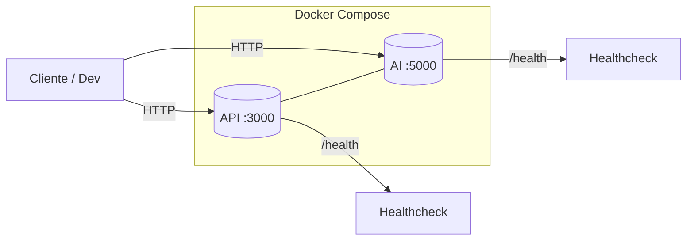

# 🛡️ Cloud‑Native DevSecOps Platform — Zero Trust & AI Observability

> Plataforma **mínima y lista para producción** que orquesta dos servicios independientes con **salud verificada**, prácticas **Zero Trust**, y **observabilidad**. Incluye scripts de arranque y verificación, healthchecks Docker y configuración por `.env`.

<p align="left">
  
  
  
</p>

---

## 📦 Componentes

* **API** → Node.js + Express + Helmet
  *Puerto interno*: `3000`  ·  *Expuesto al host*: `API_PORT_HOST` (por defecto **5858**)
* **AI** → Flask + Gunicorn
  *Puerto interno*: `5000`  ·  *Expuesto al host*: `AI_PORT_HOST` (por defecto **5859**)

> Los servicios son **independientes**, con healthchecks y rutas 404 controladas.

---

## 🧭 Arquitectura (visión rápida)



---

## ✨ Features

* **Docker Compose** para orquestación local
* **Healthchecks automáticos** (Docker + endpoints)
* **Scripts** de inicio y verificación (arranque idempotente, chequeo de puertos, logs)
* **Puertos configurables** vía `.env`
* **.dockerignore** y **.gitignore** optimizados
* **Pruebas rápidas** con `curl` + `jq`

---

## 📂 Estructura del proyecto

```
.
├── api/
│  ├── Dockerfile
│  ├── package.json
│  ├── server.js
│  └── .dockerignore
├── ai/
│  ├── Dockerfile
│  ├── requirements.txt
│  ├── app.py
│  └── .dockerignore
├── scripts/
│  ├── ai_restart.sh       # Detiene, construye y arranca servicios
│  ├── verify.sh           # Verifica endpoints API y AI
│  ├── verify_all.sh       # Alias de verify.sh
│  └── run_tests.sh        # Tests completos (health + 404 + estado Docker)
├── docker-compose.yml
├── .env.example
├── .env                   # (ignorado en git)
├── .gitignore
└── README.md
```

---

## ✅ Requisitos

* **Docker** y **Docker Compose**
* **jq** y **lsof**
  *El script `ai_restart.sh` intentará instalarlos si faltan (Linux).*
* **Linux / macOS / WSL2 (Windows)**

---

## 🚀 Quick Start

### 1) Clona y configura

```bash
git clone <REPO_URL>
cd <REPO_NAME>
cp -n .env.example .env
```

### 2) Arranca la plataforma

```bash
./scripts/ai_restart.sh
```

Este script:

* Detiene contenedores previos
* Verifica puertos libres (y sugiere cambios si hay conflicto)
* Reconstruye imágenes (`--no-cache`)
* Arranca **api** y **ai** en segundo plano
* Muestra **estado** y **URLs**

### 3) Verifica servicios

```bash
./scripts/verify.sh
```

**Salida esperada:**

```
✅ API / OK
✅ API /health OK
✅ AI / OK
✅ AI /health OK
🎉 All OK
```

---

## 🌐 Endpoints disponibles

### API (Node.js)

* `GET /` → `{ service: "api", status: "ok", ... }`
* `GET /health` → `{ status: "healthy" }`
* `GET /<ruta_inexistente>` → `404` (JSON controlado)

### AI (Flask)

* `GET /` → `{ service: "ai", status: "ok", ... }`
* `GET /health` → `{ status: "healthy" }`
* `GET /<ruta_inexistente>` → `404` (JSON controlado)

---

## ⚙️ Configuración de puertos

Edita `.env`:

| Variable        | Descripción     | Valor por defecto |
| --------------- | --------------- | ----------------- |
| `API_PORT_HOST` | Host → API:3000 | `5858`            |
| `AI_PORT_HOST`  | Host → AI:5000  | `5859`            |

Si un puerto está en uso, `ai_restart.sh` te pedirá cambiarlo.

---

## 🧪 Verificación post‑deploy

Ejecuta pruebas completas:

```bash
./scripts/run_tests.sh
```

**Qué valida:**

* API (`/`, `/health`, `404`)
* AI  (`/`, `/health`, `404`)
* **Healthchecks Docker** en estado `healthy`

**Salida esperada:**

```
✅ API OK (/, /health, 404)
✅ AI OK (/, /health, 404)
✅ Healthchecks Docker OK
🎉 All tests passed.
```

---

## 📜 Logs & Monitoring

* Estado de servicios:
  `docker compose ps`
* Logs en vivo:
  `docker compose logs -f api`
  `docker compose logs -f ai`

---

## 🧯 Troubleshooting

* **Puerto en uso** → cambia `.env` y re‑ejecuta:
  `./scripts/ai_restart.sh`
* **Healthcheck fallando** → inspecciona logs:
  `docker compose logs -f <service>`
* **Falta jq/lsof** → instala manualmente:
  `sudo apt-get update -y && sudo apt-get install -y jq lsof`

---

## 🛡️ Zero Trust & DevSecOps (prácticas)

* **API** con **Helmet** (CSP/referrer/dnsPrefetch) y manejo de 404/errores controlados
* **Límites de exposición**: puertos solo los necesarios; variables via `.env` (no secretos en git)
* **Imágenes Docker** minimalistas; añade escaneo con **Trivy** en CI
* **SAST recomendado**: **CodeQL** para JS/Python
* **Política**: listas para añadir OIDC/JWT, RBAC/ABAC y mTLS según entorno

> Revisa `api/` y `ai/` para endurecimiento adicional (headers, timeouts, logs estructurados).

---

## 🧰 Snippets útiles

### Probar rápido con `curl` + `jq`

```bash
curl -s http://localhost:${API_PORT_HOST:-5858}/health | jq .
curl -s http://localhost:${AI_PORT_HOST:-5859}/health  | jq .
```

### Ver 404 controlado

```bash
curl -si http://localhost:${API_PORT_HOST:-5858}/does-not-exist | head -n 1
curl -si http://localhost:${AI_PORT_HOST:-5859}/does-not-exist  | head -n 1
```

---

## 🧹 Limpieza

```bash
docker compose down --remove-orphans
docker system prune -f
```

---

## 🗺️ Roadmap (sugerido)

* [ ] **OpenTelemetry** (trazas/metricas/logs) y dashboards
* [ ] **Rate‑limiting** y **request‑timeouts** en API
* [ ] **Pipeline CI/CD** con CodeQL + Trivy + SBOM (Syft)
* [ ] **OPA/Gatekeeper** para policy‑as‑code (opcional)
* [ ] **k6**/**Artillery** para performance y smoke tests
* [ ] **OpenAPI**/Swagger para la API

---

## 👤 Autor

**© 2025 Emanuel** — Licencia **MIT**
**LinkedIn:** [https://www.linkedin.com/in/emanuel-gonzalez-michea/](https://www.linkedin.com/in/emanuel-gonzalez-michea/)

