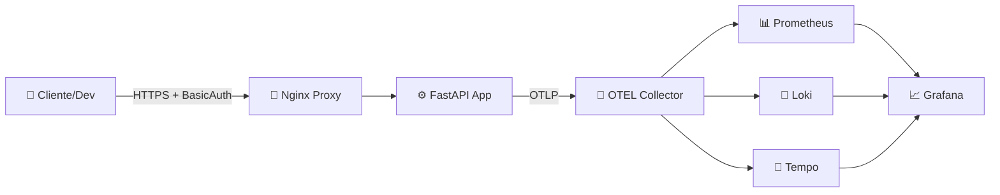

# 🛡️ Zero Trust AI Observability Lab — Cloud-Native DevSecOps

Laboratorio integral para desplegar un stack de observabilidad con enfoque **Zero Trust**, utilizando un único script (`star.sh`). Este entorno incluye métricas, logs, trazas distribuidas, healthchecks, escaneo de seguridad y proxy seguro con TLS + BasicAuth.

<p align="left">
  
  
  
  
</p>

---

## 📦 Componentes Principales

| Componente     | Descripción                                                                 |
|----------------|------------------------------------------------------------------------------|
| ⚙️ FastAPI App  | API instrumentada con OpenTelemetry para trazas y métricas                  |
| 🔐 Nginx Proxy  | Proxy seguro con TLS, BasicAuth y rate-limit                                |
| 📊 Prometheus   | Recolección de métricas del sistema y aplicación                            |
| 📜 Loki + Promtail | Gestión de logs centralizados                                             |
| 🧵 Tempo         | Trazas distribuidas para análisis de rendimiento                           |
| 📈 Grafana       | Panel unificado para visualización de métricas, logs y trazas              |

---

## 🧭 Arquitectura del Sistema



🔄 **Flujo resumido:**
- El cliente accede vía HTTPS con autenticación básica.
- Nginx actúa como proxy seguro.
- FastAPI envía trazas, métricas y logs al OTEL Collector.
- Los datos se distribuyen a Prometheus, Loki y Tempo.
- Grafana centraliza la visualización.

---

## ✨ Funcionalidades Clave

- 🔧 Setup automatizado con `./star.sh up`
- 🔐 TLS + BasicAuth preconfigurados
- 📊 Dashboards listos vía provisioning
- 📈 Logs, métricas y trazas conectadas
- 🛡️ Escaneo de seguridad con Trivy (`./star.sh scan`)
- 🧹 Clean-up idempotente (`./star.sh clean`)

---

## 📁 Estructura del Proyecto

<p align="left">
  
  
  
  
  
  
  
  
</p>

```
📦 zero-trust-ai-observability-lab/
├── star.sh              🔧 Script maestro para setup, scan y clean
├── docker-compose.yml   📦 Orquestación de servicios
├── prometheus.yml       📊 Configuración de métricas
├── otel-collector.yaml  📡 Pipeline de observabilidad OTEL
├── nginx.conf           🔐 Proxy seguro con TLS + Auth
├── certs/               🔏 Certificados TLS self-signed
├── app/                 ⚙️ FastAPI con OpenTelemetry
├── provisioning/        📈 Dashboards y datasources para Grafana
└── README.md            📘 Documentación del proyecto
```

---

## ✅ Requisitos Previos

- Docker + Docker Compose
- OpenSSL
- Linux / macOS / WSL2

---

## 🚀 Quick Start

```bash
git clone https://github.com/Emanuelgm1998/zero-trust-ai-observability-lab.git
cd zero-trust-ai-observability-lab
chmod +x star.sh
./star.sh up
./star.sh status
for i in {1..10}; do curl -k -u admin:admin https://localhost:8443/; done
```

---

## 🌐 Endpoints del Sistema

| Servicio     | URL                          | Credenciales     |
|--------------|------------------------------|------------------|
| 📈 Grafana    | [localhost:3000](http://localhost:3000)     | `admin / admin` |
| 📊 Prometheus | [localhost:9090](http://localhost:9090)     | —                |
| 📜 Loki API   | [localhost:3100](http://localhost:3100)     | —                |
| 🧵 Tempo       | [localhost:3200](http://localhost:3200)     | —                |
| ⚙️ App (HTTPS) | [localhost:8443](https://localhost:8443)    | `admin / admin` |

---

## 🔍 Verificación Post-Deploy

```bash
./star.sh logs
curl -k -u admin:admin https://localhost:8443/healthz
# → {"status":"ok"}
```

---

## 🔐 Enfoque Zero Trust & DevSecOps

- ✅ TLS obligatorio (certificados self-signed)
- ✅ Autenticación básica (BasicAuth)
- ✅ Rate-limit configurado en Nginx
- ✅ Escaneo de seguridad con Trivy
- ✅ Observabilidad 360°: métricas, logs y trazas

---

## 👨‍💻 Autor

**Emanuel González Michea**  
Cloud Architect · SysOps · DevSecOps · Observability Specialist  
📎 [GitHub](https://github.com/Emanuelgm1998) · 🌐 [LinkedIn](https://www.linkedin.com/in/emanuelgm1998)

